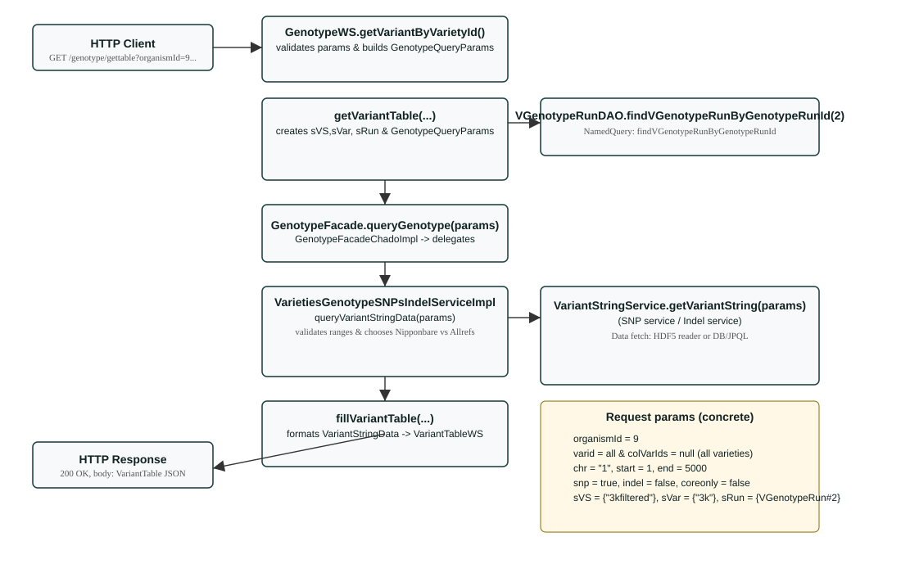

# Genotype call flow

This document contains an ASCII/graphical diagram and a Mermaid diagram showing the runtime flow when calling the Genotype REST endpoint for the parameters you requested: organismId=9, varid=all, chr=1, start=1, end=5000, snps=true.



## Mermaid diagram

```mermaid
flowchart TD
  A[HTTP Client\nGET /genotype/gettable?organismId=9&varid=all&chr=1&start=1&end=5000&snp=true]
  B[GenotypeWS.getVariantByVarietyId()\n(.../ws/rest/GenotypeWS.java)]
  C[getVariantTable(...)\n(builds sVS,sVar,sRun & GenotypeQueryParams)]
  D[VGenotypeRunDAO.findVGenotypeRunByGenotypeRunId(2)\n(named query)]
  E[GenotypeFacade.queryGenotype(params)\n(GenotypeFacadeChadoImpl)]
  F[VarietiesGenotypeSNPsIndelServiceImpl.queryVariantStringData(params)]
  G[VariantStringService.getVariantString(params)\n(hdf5 reader or DB/JPQL)]
  H[fillVariantTable(...)\n(formats VariantTableWS)]
  I[HTTP Response: 200 OK\nVariantTable JSON]

  A --> B
  B --> C
  C --> D
  C --> E
  E --> F
  F --> G
  F --> H
  H --> I
```

## Concrete GenotypeQueryParams (constructed by `getVariantTable`)

- colVarIds = null (varid="all" → query all varieties)
- sChr = "1"
- lStart = 1L
- lEnd = 5000L
- bSNP = true
- bIndel = false
- sVS = {"3kfiltered"}
- sVar = {"3k"}
- sRun = { VGenotypeRun#2 } (returned by `findVGenotypeRunByGenotypeRunId(2)`)
- bMismatchonly = false
- poslist = null
- sSubpopulation = null
- sLocus = null
- bAlignIndels = false
- organism = Organism returned by `organismDAO.getOrganismByID(9)`
- dataset = `VarietyFacade.DATASET_SNPINDELV2_IUPAC`

## Key files to inspect / breakpoints

- `GenotypeWS.java` — entrypoint and `getVariantTable(...)` (file opened in the editor)
- `VGenotypeRun.java` — entity and named query `findVGenotypeRunByGenotypeRunId`
- `VGenotypeRunDAOImpl.java` — DAO impl that runs the named query
- `GenotypeFacadeChadoImpl.java` — delegates to `VarietiesGenotypeService`
- `VarietiesGenotypeSNPsIndelServiceImpl.java` — core query logic and call to `VariantStringService`
- `VariantStringService` implementations — actual data fetch (HDF5 or DB)
- `VariantAlignmentTableArraysImpl` / `VariantTableWS` — formatting to table

## Converting the SVG to PNG on Windows (optional)

If you want a PNG version created locally, you can convert the SVG using Inkscape (recommended) or ImageMagick. Example (Windows cmd.exe, Inkscape must be installed and in PATH):

```bat
"C:\Program Files\Inkscape\inkscape.exe" "docs\genotype_diagram.svg" --export-type=png --export-filename="docs\genotype_diagram.png"
```

Or using ImageMagick (if installed):

```bat
magick convert "docs\genotype_diagram.svg" "docs\genotype_diagram.png"
```

---

If you'd like, I can also generate a Graphviz `.dot` and a rendered PNG here in the repo (I can create the dot file and an SVG); tell me which rendering you prefer or whether to set different diagram dimensions.